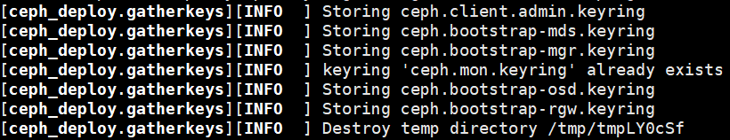
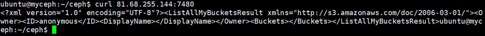
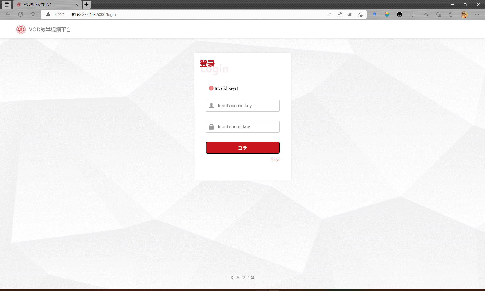

# Project 3：VOD Platform

本项目在单云服务器（腾讯云Ubuntu 18.04）上部署基于Ceph文件系统的VDO网站。

## Ceph环境配置

修改主机名

```shell
ubuntu@ceph1:~$ sudo hostnamectl set-hostname myceph
```

查看本机ip，得到内网ip为 172.17.0.12/20


将ip地址写入hosts文件：

```shell
ubuntu@ceph1:~$ echo "172.17.0.12 myceph" >> /etc/hosts
```

安装ceph-deploy用于自动化部署ceph环境，同时安装ceph、radosgw：

```shell
ubuntu@ceph1:~$ sudo apt-get install -y ceph-deploy, ceph, radosgw
```


## Ceph运行

创建目录并初始化集群：

```shell
ubuntu@ceph1:~$ mkdir ceph
ubuntu@ceph1:~$ cd ./ceph/
ubuntu@ceph1:~$ ceph-deploy new myceph
```


由于本项目只需要运行在单节点上，故修改ceph配置文件如下：


初始化ceph的mon进程：

```shell
ubuntu@ceph1:~/ceph$ ceph-deploy --overwrite-conf mon create-initial
```




将ceph.client.admin.keyring拷贝至各节点上：


启动mgr进程：


查看集群状态：


准备数据盘：


划分数据盘：


格式化数据盘：


创建osd：

```shell
ubuntu@ceph1:~/ceph$ ceph-deploy osd create --data  /dev/vdb myceph
```

启动rgw：


此时即可通过curl验证rgw的可访问性：




设置pool参数：


创建用户并赋予权限

```shell
ubuntu@ceph1:~/ceph$ sudo radosgw-admin user create --uid="admin" --display-name="administrator" --access_key="admin" --secret="admin"
ubuntu@ceph1:~/ceph$ sudo radosgw-admin caps add --uid="admin" --caps="users=read, write; usage=read,write; buckets=read,write"
ubuntu@ceph1:~/ceph$ sudo radosgw-admin user info --uid="admin"
```


至此，服务器上的基础ceph对象存储环境已搭建完毕、成功运行。为了方便后续程序与ceph对接的顺畅性，需要改变 /etc/ceph 文件夹权限：

```
ubuntu@myceph:~$ sudo chmod -R 777 /etc/ceph/
```


## 对象数据准备

### 对象bucket初始化

分别创建用于存储视频文件本体对象与封面图片对象的空bucket，权限设为公开读写：


实际过程如下：


### 对象数据生成

构造对象元数据，并将视频与图片对象分别添加至对应bucket中：


实际过程如下：


## 网站效果

本项目基于Python的Flask进行网站搭建，并通过boto3库与ceph对象存储进行对接，主要实现了四大功能页面与两大错误页面。

### 用户登录页面

登录页面主要是一个表单，登录成功则将部分关键信息存储于session中，便于在其他页面进行访问，账户密码不正确则弹出相应信息。


实际运行效果如下：


密码错误：



### 用户注册页面

注册页面同样是一个表单，注册并登录成功则将部分关键信息存储于session中，便于在其他页面进行访问，账户密码不正确则弹出相应信息。


实际运行效果如下：


两次密码设定不相符：


uid重复：


### 网站主页

检查session中用户的登录状态，若已登录则返回正常页面，未登录则跳转至401错误页面：


实际运行效果如下：

 


上方nav-bar左侧是图标及平台名称，可以通过点击返回主页；右侧是用户id以及退出登录按钮。

主页面上方是介绍部分，其左侧是平台介绍视频，右侧上方为slide-switch，循环展示三个推荐视频的封面，右侧下方为介绍文字：

> 该平台是以ceph对象文件系统为载体的Video-on-Demand (VoD)教学资源平台，实现了简单的用户注册与登录、视频列表与播放等功能。网站采用Python-Flask轻量级框架作为后端支持进行搭建，并采用boto3来与ceph提供的s3对象存储服务进行交互，其中，视频文件与视频封面文件分别存储于由用户admin所持有的bucket <a href="http://81.68.255.144:7480/videos/" target="_blank">videos</a>与 <a href="http://81.68.255.144:7480/images/" target="_blank">images</a>中.

主页面下方是所有课程视频的列表，可以通过点击跳转至对应播放页面。

### 视频播放页面

视频播放页面通过session与页面参数结合获取对应的视频对象，同样需要检查是否登录，并且若对象不存在将跳转至404页面。


实际运行效果如下：


中央为视频主体，下方还有视频的标题、发布时间、学科分类、发布者等元数据信息。

### 401：Unauthorized Access

网站的主页与视频两大类内容页面均需要检查用户登录情况，未登录则会跳转至401页面，要求用户进行登录。


### 404：Page Not Found

用户访问的页面不存在时，会跳转至404页面，提示用户返回主页（已登录）或登录页面（未登录）。


至此，网站的全部页面展示完毕。

## 参考资料

【1】[ceph-deploy在线安装ceph(Ubuntu18)_零起跑线的博客-CSDN博客](https://blog.csdn.net/blvyoucan/article/details/106599548)

【2】[简介 - Flask 入门教程 (helloflask.com)](https://read.helloflask.com/)